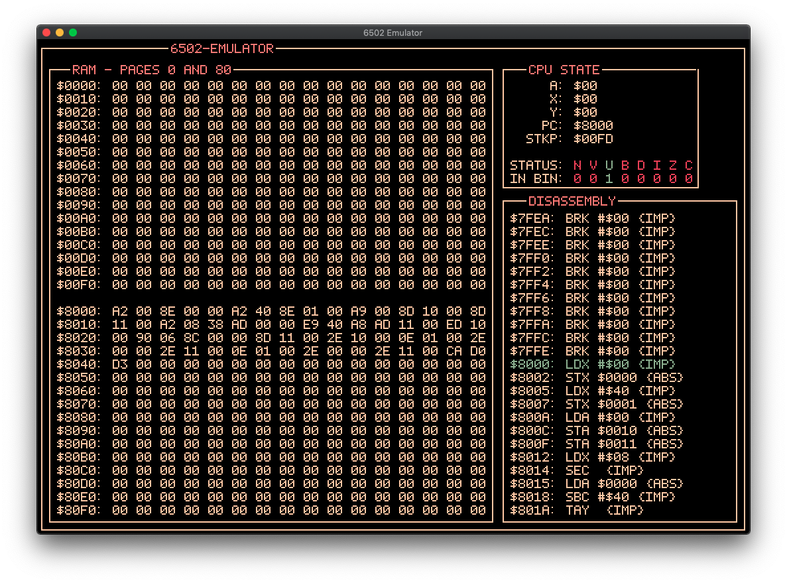

# MOS-6502-Rusted

The goal of this project was to create a simple, no frills emulation of the 6502 as a means to learn rust. As I was focussing 'discovering' the language myself and see first hand the differences between rust and older languages I stayed away from examples of rust based emulations and instead followed the direction of the ["One Lone Coder"](https://github.com/OneLoneCoder) and his youtube series on [emulating a NES](https://www.youtube.com/watch?v=nViZg02IMQo&list=PLrOv9FMX8xJHqMvSGB_9G9nZZ_4IgteYf) - similarities are therefore apparent.

I did try to make the debugger display a little more pleasing to look at however: 
<p align="center">
  
</p>

## Using the emulator

To use the emulator it is as easy as running the following commands in the terminal:

Clone it,

```
git clone git@github.com:JamesPatrickGill/mos-6502-rusted.git
```

Run it,

```
cd mos-6502-rusted
cargo run
```

Then press space to step through the code, one instruction at a time. 

### Changing the program

The emulator is preloaded with a square root program that square roots 64 (0x0040) stored in this is stored across the first two bytes of memory 0x0000 holding the high byte and 0x0001 holding the low byte. The root is then stored on 0x0010 and the remainder in 0x0011. There is also a function the performs 3 multipled by 10 using repeated addition but this is commented out. 

To use your own program, it must be in object code and passed to the `mos_6502_emulator` function. Then rerunning the emulator with `cargo run` should show the program loaded into the ram on page 80. **Note:** As the emulator debugger shows pages 0 and 80 of the ram, it is recommended to use the 0 page for variables so you can actually see something happen as 80 is where the program is read into.

### Useful links for creating programs

* [Assembler - To compile Object Code](https://www.masswerk.at/6502/assembler.html)
* [Examples of 6502 Source Code](http://6502.org/source/)
* [More Examples of 6502 Source Code](http://6502org.wikidot.com/software)

## Reading the Debugger

The debugger has three sections: Ram, Cpu State and Dissasembly.

#### RAM 

Basic display of the ram in two blocks. 
* Page 0 from byte 0x0000 to 0x00FF - Recommended for variable use
* Page 80 from byte 0x8000 to 0x80FF - Is default point at which program is stored and read from, easily altered in the code though if one wishes it.

All values in the ram are unsiged 8bit integer values displayed in hex.

#### CPU State 

The CPU State is described by its 5 registers.  This is rather complicated but there is enough info below ( I think... ) to get off the ground.

* A  (Accumulator)- Byte wide register - supports using the status register for carrying, overflow detection, and so on
* X and Y (Indexes) - Similar to accumulator - and useful for loop counters due to access to several operations such as DEC, INC and branch instruction.
* PC (Program Counter) - 2 byte wide register which points to the next instruction to be executed.
* STKP (Stack Pointer) - Byte wide register, holds the low 8 bits of the next free location on the stack.
* STATUS (Status Flags) - 8 bit register that act as flags for the cpu. See this: [Status Flags](https://wiki.nesdev.com/w/index.php/Status_flags)

#### Dissasembly 

Simply this is a nice way to visualise the program running. The highlighted line is the next instruction to run, the first column is the ram address the instruction starts at, the second is the CPU operation to run and next comes either the value or address given to the operation, along with addressing mode contained in brackets. Notes square bracket contain the address a branch statement will jump to.

## Help

This a quick and dirty implementation and there are most definitely some bugs in the emulation. I just wanted something out the door and as this is for fun, I can fix as I go. Therefpre any one who wants to have a go at debugging or even fixing the code, please have a go - looking to learn and what better way than a code review. 

The future goal of this as you may be able to tell is implement a very basic NES emulator.
